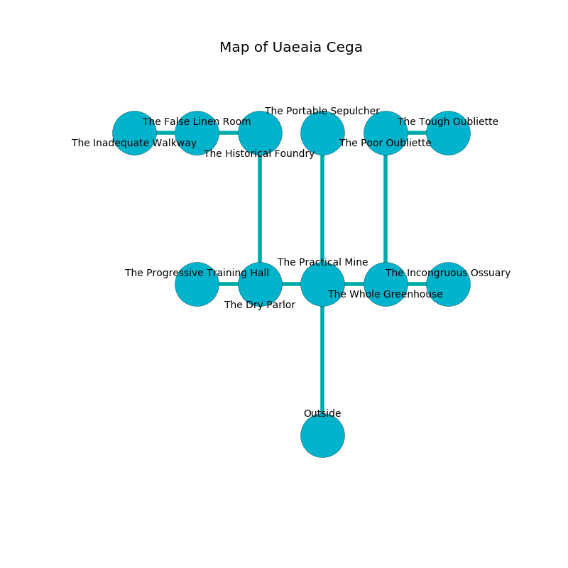

%Ruin Dogs

##Uaeaia Cega
###Overview
Uaeaia Cega is located on a broken rift. Parts of it are flooded. A lunar eclipse is happening outside. It is occupied by Sahuagins. Rema Robb The Machiavellian, a Bulette is here. The Sahuagins are the slaves of Rema Robb The Machiavellian. She  is founding a new religion. 

###Artifact
####Hfebbef

Hfebbef looks like a transparent blade. It is a pale white color. Psychic energy shifts near it. When carried it burns the mind. 

###Locations

####the practical mine
There is an Unicorn here. The air smells like acorn here. 

* To the west a torchlit cavern connects to [the dry parlor](#the-dry-parlor).
* To the east a long path leads to [the whole greenhouse](#the-whole-greenhouse).
* To the north a flooded cavern opens to [the portable sepulcher](#the-portable-sepulcher).
* To the south is the entrance.

####the dry parlor
The concrete walls are bloodstained. The floor is smooth. Gray razorgrass is growing from the walls. There is an Umber Hulk here. The air smells like grain here. 

* There is a coat here.
* [Hfebbef](#Hfebbef) is here.
* To the west a narrow pathway connects to [the progressive training hall](#the-progressive-training-hall).
* To the east a torchlit cavern leads to [the practical mine](#the-practical-mine).
* To the north a twisted cave connects to [the historical foundry](#the-historical-foundry).

####the whole greenhouse
The crystal walls are caving in. The floor is sticky. 

* To the west a long path opens to [the practical mine](#the-practical-mine).
* To the east a hazy artery leads to [the incongruous ossuary](#the-incongruous-ossuary).
* To the north a dark pathway opens to [the poor oubliette](#the-poor-oubliette).

####the portable sepulcher
Green ferns are swaying in broken urns. The mirrored walls are pristine. 

* There is a coat here.
* To the south a flooded cavern connects to [the practical mine](#the-practical-mine).

####the incongruous ossuary
There are a Giant Lizard, a Weretiger, an Elk, and a Gibbering Mouther here. White mushrooms are decaying from the walls. 

* To the west a hazy artery leads to [the whole greenhouse](#the-whole-greenhouse).

####the historical foundry
Gray ferns are decaying in broken urns. The air tastes like tolu here. 

There is an engraving on the wall written in common. 

> [Hfebbef](#Hfebbef)
>
> satisfied, fair, rural
>
> yet constructive
>
> secondary, square, structural
>
> A ship is a simplicity
>
> unique, equal, brown
>
> discreet and honorable
>
> comprehensive and true
>
> A whistle is a wildlife
>
> common, sick, eligible
>
> A pocket is a negligence
>
> yet never seasonal
>
> but orthodox
>
> A house is a pedestrian
>
> express, senior, imperial
>
> [Hfebbef](#Hfebbef)
>

* To the west a narrow hall connects to [the false linen room](#the-false-linen-room).
* To the south a twisted cave leads to [the dry parlor](#the-dry-parlor).

####the false linen room
Red lichens are growing in a patch on the floor. The crystal walls are caving in. The air smells like rye bread here. The floor is smooth. 

* There is a carriage here.
* To the west a windy hallway connects to [the inadequate walkway](#the-inadequate-walkway).
* To the east a narrow hall leads to [the historical foundry](#the-historical-foundry).

####the poor oubliette
The floor is glossy. There are three Sahuagin Priestesses here. There is a trap here. When activated, a pressure plate will close a portcullis. Green mushrooms are swaying from the ceiling. The air smells like hops here. The Sahuagins are willing to negotiate. 

* To the east a dark cavern connects to [the tough oubliette](#the-tough-oubliette).
* To the south a dark pathway opens to [the whole greenhouse](#the-whole-greenhouse).

####the inadequate walkway
The metallic walls are caving in. 

* To the east a windy hallway leads to [the false linen room](#the-false-linen-room).

####the tough oubliette
White mushrooms are swaying in broken urns. There are an Intellect Devourer and a Flameskull here. 

There is an engraving on a stone written in Sahuagins Script. 

> I want to find [Hfebbef](#Hfebbef).
>
> Try jumping.
>

* There is a whip here.
* To the west a dark cavern leads to [the poor oubliette](#the-poor-oubliette).

####the progressive training hall
Gray mushrooms are swaying in cracks in the floor. The floor is flooded with six inch deep cold water. The concrete walls are pristine. 

There is an engraving on a tablet written in Sahuagins Script. 

> Oh weak you
>
> clear and true
>
> brave and loud
>
> cruelty is proud
>

* [Rema Robb The Machiavellian](#Rema-Robb-The-Machiavellian) is here.
* To the east a narrow pathway connects to [the dry parlor](#the-dry-parlor).

