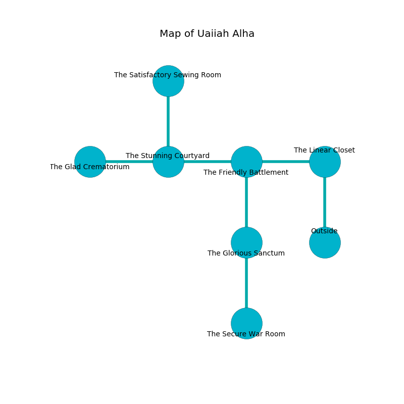

%Ruin Dogs

##Uaiiah Alha
###Overview
Uaiiah Alha is located in an obsidion mountain. Some areas of Uaiiah Alha are flooded. A massive flood is happening outside. It is occupied by Troglodytes. Lewis Fisk The Untrustworthy, a Fire Giant is here. The Troglodytes are battling Lewis Fisk The Untrustworthy. She  is trying to discover [Deiieha Dafbaemeh](#Deiieha-Dafbaemeh). 

###Artifact
####Deiieha Dafbaemeh

Deiieha Dafbaemeh is a powerful artifact in the shape of a soft meteorite. Gravity glows around it. It smells like turni. It is a pale white color. When eaten it ignites its surrroundings. 

###Locations

####the linear closet
The obsidion walls are unsettled. The air smells like immortelle here. White mushrooms are decaying in a patch on the floor. 

* To the west a dripping gap leads to [the friendly battlement](#the-friendly-battlement).
* To the south is the entrance.

####the friendly battlement
The floor is smooth. The air smells like peanut butter here. 

* To the west a dripping path connects to [the stunning courtyard](#the-stunning-courtyard).
* To the east a dripping gap leads to [the linear closet](#the-linear-closet).
* To the south a narrow pathway connects to [the glorious sanctum](#the-glorious-sanctum).

####the glorious sanctum
Red moss is swaying from the walls. 

* [Deiieha Dafbaemeh](#Deiieha-Dafbaemeh) is here.
* To the north a narrow pathway leads to [the friendly battlement](#the-friendly-battlement).
* To the south a flooded corridor leads to [the secure war Room](#the-secure-war-Room).

####the stunning courtyard
The air tastes like green bean here. There are an Earth Elemental, a Phase Spider, and a Flying Sword here. Green moss is swaying from the ceiling. 

* There is a roof here.
* To the west a long corridor leads to [the glad crematorium](#the-glad-crematorium).
* To the east a dripping path connects to [the friendly battlement](#the-friendly-battlement).
* To the north a dark artery connects to [the satisfactory sewing room](#the-satisfactory-sewing-room).

####the glad crematorium
The stone walls are unsettled. There are thirty two Troglodytes here. The air smells like solvent here. Blue lichens are decaying in broken urns. The Troglodytes are willing to negotiate. 

There is an engraving on the wall written in common. 

> A curtain is a folk
>
> common, small, live
>
> jealous, late, awful
>
> daily, different, cute
>
> A wall is a resource
>
> indigenous, premature, kind
>
> A pot is a platform
>
> legislative, political, delicate
>
> We are love
>
> yet crude
>
> yet never childish
>
> noisy and welcome
>
> sticky, wise, weak
>
> but never marine
>
> but vulnerable
>
> tough, late, early
>

* To the east a long corridor connects to [the stunning courtyard](#the-stunning-courtyard).

####the satisfactory sewing room
Blue mushrooms are decaying from the ceiling. The air smells like starch here. The floor is smooth. 

There is an engraving on a monolith written in common. 

> Treasure here.
>

* There is a pendant here.
* To the south a dark artery leads to [the stunning courtyard](#the-stunning-courtyard).

####the secure war Room
There are a Carrion Crawler, a Hobgoblin Captain, a Brown Bear, and a Green Hag here. 

There is an engraving on a stone written in Troglodytes Script. 

> A store is a snail
>
> familiar, established, dry
>
> new and cruel
>
> you will be loved
>

* [Lewis Fisk The Untrustworthy](#Lewis-Fisk-The-Untrustworthy) is here.
* To the north a flooded corridor opens to [the glorious sanctum](#the-glorious-sanctum).

