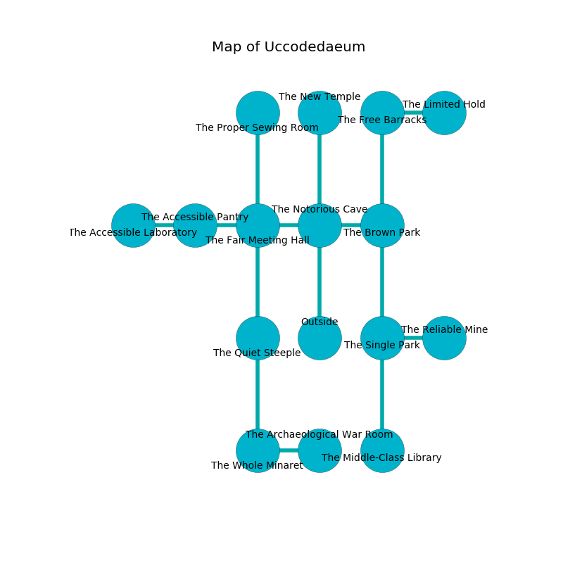

%Ruin Dogs

##Uccodedaeum
###Overview
Uccodedaeum is located on a volcanic rift. Parts of Uccodedaeum are frozen. A massive storm is happening outside. It is occupied by Sahuagins. Juanita Barajas The Unkind, a Knight is here. The Sahuagins are the slaves of Juanita Barajas The Unkind. She  is founding a new religion. 

###Artifact
####Udcacdaeum Eddamlaes

Udcacdaeum Eddamlaes looks like a transparent meteorite. It is a bright brown color. Psychic energy bends around it. When carried it grants power to its owner. 

###Locations

####the notorious cave
The brick walls are ruined. The floor is glossy. Gray lichens are sprouting in cracks in the floor. There are two Sahuagin Priestesses here. The air smells like smoke here. The Sahuagins are drunk. 

* There is a sock here.
* To the west a dark walkway opens to [the fair meeting hall](#the-fair-meeting-hall).
* To the east a dark pathway opens to [the brown park](#the-brown-park).
* To the north a flooded walkway connects to [the new temple](#the-new-temple).
* To the south is the entrance.

####the fair meeting hall
Red lichens are swaying in a patch on the floor. The floor is sticky. 

There is an engraving on a monolith written in common. 

> They are frozen
>
> always agile
>

* There is a demon here.
* To the west a small corridor connects to [the accessible pantry](#the-accessible-pantry).
* To the east a dark walkway leads to [the notorious cave](#the-notorious-cave).
* To the north a narrow cavern opens to [the proper sewing room](#the-proper-sewing-room).
* To the south a flooded cave leads to [the quiet steeple](#the-quiet-steeple).

####the quiet steeple
The air smells like oatmeal here. There are a Mud Mephit, an Aarakocra, a Blink Dog, a Giant Centipede, a Minotaur, a Rat, and a Scarecrow here. The floor is smooth. Green mushrooms are growing in cracks in the floor. 

* There is a fork here.
* To the north a flooded cave connects to [the fair meeting hall](#the-fair-meeting-hall).
* To the south a twisted gap opens to [the whole minaret](#the-whole-minaret).

####the brown park
There are two Sahuagin Priestesses here. One of the Sahuagins is on watch, the rest are fighting amongst themselves. 

There is an engraving on a stone written in Sahuagins Script. 

> Oh dire we
>
> it is always bland
>
> but free
>
> sadness is grand
>

* To the west a dark pathway leads to [the notorious cave](#the-notorious-cave).
* To the north a hazy walkway leads to [the free barracks](#the-free-barracks).
* To the south a small gap opens to [the single park](#the-single-park).

####the single park
Green mushrooms are swaying from the walls. The floor is smooth. 

* To the east a hazy artery connects to [the reliable mine](#the-reliable-mine).
* To the north a small gap opens to [the brown park](#the-brown-park).
* To the south a dripping cave opens to [the middle-class library](#the-middle-class-library).

####the new temple
The air tastes like black tea here. The glass walls are unsettled. Green lichens are swaying in cracks in the floor. 

There is an engraving on the wall written in Sahuagins Script. 

> I am lovely.
>

* There is a door here.
* To the south a flooded walkway opens to [the notorious cave](#the-notorious-cave).

####the whole minaret
The mirrored walls are unsettled. The floor is bloodstained. The air tastes like hay here. 

* To the east a narrow pathway leads to [the archaeological war Room](#the-archaeological-war-Room).
* To the north a twisted gap leads to [the quiet steeple](#the-quiet-steeple).

####the accessible pantry
The floor is bloodstained. 

* To the west a torchlit threshold leads to [the accessible laboratory](#the-accessible-laboratory).
* To the east a small corridor leads to [the fair meeting hall](#the-fair-meeting-hall).

####the reliable mine
There are a Guard, a Mastiff, a Black Dragon Wyrmling, a Hyena, and an Awakened Tree here. The air smells like horseradish here. Blue mushrooms are decaying in broken urns. 

* To the west a hazy artery opens to [the single park](#the-single-park).

####the proper sewing room
White ferns are sprouting from the walls. There are two Sahuagin Priestesses here. The mirrored walls are caving in. The floor is cluttered with ashes. The Sahuagins are willing to negotiate. 

* To the south a narrow cavern leads to [the fair meeting hall](#the-fair-meeting-hall).

####the archaeological war Room
The mirrored walls are caving in. There are a Quaggoth Spore Servant, a Sea Horse, a Gas Spore, and an Awakened Tree here. The floor is glossy. 

There is an engraving on a tablet written in common. 

> I am seeking [Udcacdaeum Eddamlaes](#Udcacdaeum-Eddamlaes).
>
> Try praying.
>

* To the west a narrow pathway opens to [the whole minaret](#the-whole-minaret).

####the middle-class library
There is a Knight here. The mirrored walls are ruined. The floor is cluttered with bones. The air smells like salmon here. 

There is an engraving on the ceiling written in common. 

> I thought about running.
>

* To the north a dripping cave opens to [the single park](#the-single-park).

####the accessible laboratory
The floor is flooded with two inch deep cold water. Blue ferns are growing from the walls. The air tastes like peach here. 

There is an engraving on the wall written in common. 

> A needle is a velvet
>
> weak and modest
>
> A church is a fiction
>
> nuclear and passive
>
> [Udcacdaeum Eddamlaes](#Udcacdaeum-Eddamlaes)
>
> limited and organic
>
> encouraging and blonde
>
> A garden is a lack
>
> just, technical, tasty
>
> but never outer
>
> A needle is a velvet
>

* [Juanita Barajas The Unkind](#Juanita-Barajas-The-Unkind) is here.
* To the east a torchlit threshold opens to [the accessible pantry](#the-accessible-pantry).

####the free barracks
The floor is smooth. The air tastes like raw potato here. There are two Sahuagin Priestesses here. There is a trap here. When activated, a magical proximity detector will swing a tripping chain. If the Sahuagins notice the Ruin Dogs, one of them will retreat and alert the others. 

* There is a cup here.
* [Udcacdaeum Eddamlaes](#Udcacdaeum-Eddamlaes) is here.
* To the east a dark hallway opens to [the limited hold](#the-limited-hold).
* To the south a hazy walkway leads to [the brown park](#the-brown-park).

####the limited hold
The air smells like meat here. The obsidion walls are caving in. 

* To the west a dark hallway connects to [the free barracks](#the-free-barracks).

