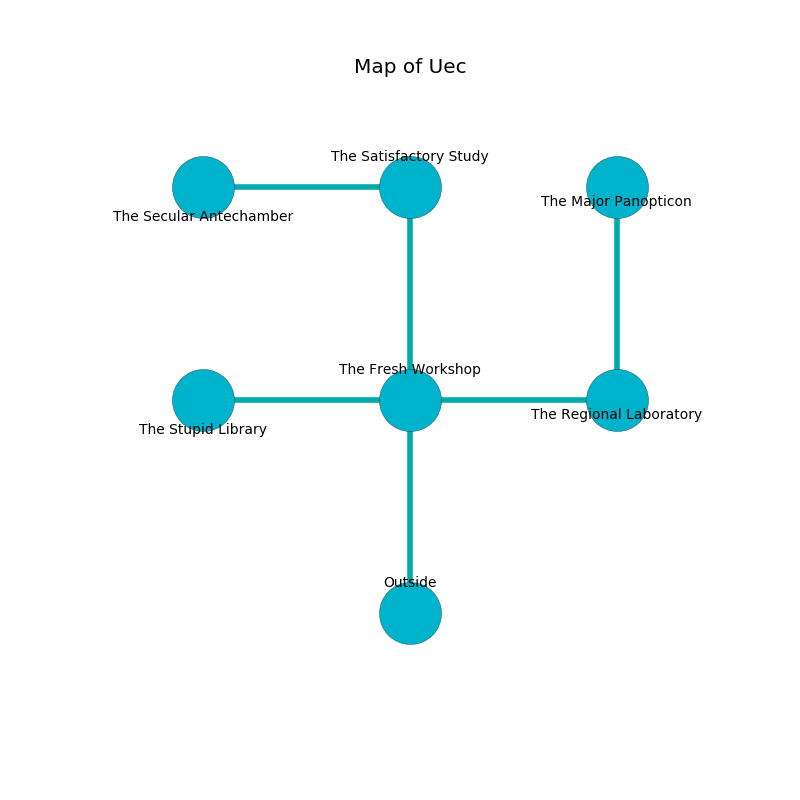

%Ruin Dogs

##Uec
###Overview
Uec is located in a volcanic plain. Regions of it are corrupted. A massive flood is happening outside. It is occupied by Githyanki. Johnson Noll The Patronizing, a Hill Giant is here. The Githyanki are battling Johnson Noll The Patronizing. He  is trying to understand [The Structural Europe](#The-Structural-Europe). 

###Artifact
####The Structural Europe

The Structural Europe looks like a mushy prism. It smells like dry	durian. When smelled it destroys itself. 

###Locations

####the fresh workshop
There are a Quasit, a Wereboar, a Giant Eagle, and a Killer Whale here. 

* [Johnson Noll The Patronizing](#Johnson-Noll-The-Patronizing) is here.
* To the west a narrow cave opens to [the stupid library](#the-stupid-library).
* To the east a windy gap leads to [the regional laboratory](#the-regional-laboratory).
* To the north a twisted hall opens to [the satisfactory study](#the-satisfactory-study).
* To the south is the entrance.

####the satisfactory study
The floor is bloodstained. The air smells like lard here. There are two Githyanki Warriors here. Gray moss is growing in broken urns. The Githyanki are performing a ritual. If not interrupted, [Johnson Noll](#Johnson-Noll) will be magically alarmed. 

There is an engraving on a monolith written in common. 

> I could not try dying.
>

* [The Structural Europe](#The-Structural-Europe) is here.
* To the west a dark path leads to [the secular antechamber](#the-secular-antechamber).
* To the south a twisted hall connects to [the fresh workshop](#the-fresh-workshop).

####the regional laboratory
Blue ferns are growing in broken urns. The air smells like menthol here. There are two Githyanki Warriors here. The Githyanki are willing to negotiate. 

* To the west a windy gap connects to [the fresh workshop](#the-fresh-workshop).
* To the north a long cave connects to [the major panopticon](#the-major-panopticon).

####the major panopticon
The stone walls are covered in mold. The floor is cluttered with rocks. White lichens are sprouting from the ceiling. 

There is an engraving on a stone written in Githyanki Script. 

> A branch is an outline
>
> careful, ethical, intense
>
> A branch is an outline
>

* To the south a long cave opens to [the regional laboratory](#the-regional-laboratory).

####the stupid library
Gray mushrooms are sprouting in cracks in the floor. The floor is bloodstained. 

There is an engraving on the wall written in Githyanki Script. 

> I thought about cowering.
>

* To the east a narrow cave connects to [the fresh workshop](#the-fresh-workshop).

####the secular antechamber
Red lichens are sprouting in cracks in the floor. There are two Githyanki Warriors here. The air smells like melon here. One of the Githyanki is pointing a ballista at the entrance. 

* To the east a dark path opens to [the satisfactory study](#the-satisfactory-study).

