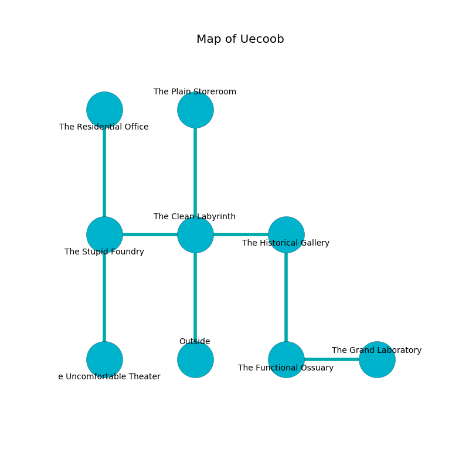

%Ruin Dogs

##Uecoob
###Overview
Uecoob is located under a volcanic city. Some rooms of it are cursed. The ruin is burning. It is occupied by Centaurs. Reena Padgett The Finicky, a Fire Giant is here. The Centaurs worship Reena Padgett The Finicky. She  is founding a new religion. 

###Artifact
####Daef

Daef has the form of a sharp doll. It smells like potato. When worn it turns surrounding objects to ashes. 

###Locations

####the clean labyrinth
The floor is glossy. The crystal walls are bloodstained. 

* To the west a small gap leads to [the stupid foundry](#the-stupid-foundry).
* To the east a hazy pathway opens to [the historical gallery](#the-historical-gallery).
* To the north a hazy corridor leads to [the plain storeroom](#the-plain-storeroom).
* To the south is the entrance.

####the stupid foundry
The obsidion walls are pristine. White razorgrass is decaying in a patch on the floor. 

There is an engraving on a stone written in common. 

> A chin is a wool
>
> nervous and viable
>
> A thread is a promotion
>
> but never left
>
> A tooth is a folk
>
> always incongruous
>

* [Daef](#Daef) is here.
* [Reena Padgett The Finicky](#Reena-Padgett-The-Finicky) is here.
* To the east a small gap connects to [the clean labyrinth](#the-clean-labyrinth).
* To the north a dark corridor opens to [the residential office](#the-residential-office).
* To the south a hazy hall leads to [the uncomfortable theater](#the-uncomfortable-theater).

####the historical gallery
The air tastes like roasted meaty here. The floor is flooded with four inch deep scalding water. The crystal walls are bloodstained. Green moss is growing in a patch on the floor. There are five Centaurs here. The Centaurs are performing a ritual. If not interrupted, the Centaurs will become more powerful. 

* To the west a hazy pathway leads to [the clean labyrinth](#the-clean-labyrinth).
* To the south a long walkway connects to [the functional ossuary](#the-functional-ossuary).

####the residential office
The air smells like sawdust here. 

* There is a sponge here.
* There is a chest here.
* To the south a dark corridor connects to [the stupid foundry](#the-stupid-foundry).

####the functional ossuary
Red lichens are growing in broken urns. The floor is bloodstained. There are a Chuul, a Grell, a Fire Elemental, and a Mule here. 

* To the east a twisted gap opens to [the grand laboratory](#the-grand-laboratory).
* To the north a long walkway opens to [the historical gallery](#the-historical-gallery).

####the plain storeroom
The glass walls are pristine. Blue mushrooms are swaying from the ceiling. The floor is sticky. There are five Centaurs here. If the Centaurs notice the Ruin Dogs, one of them will retreat and alert [Reena Padgett](#Reena-Padgett). 

* To the south a hazy corridor opens to [the clean labyrinth](#the-clean-labyrinth).

####the grand laboratory
Blue mushrooms are growing in cracks in the floor. The glass walls are pristine. The floor is flooded with two inch deep cold water. The air tastes like rubber here. 

* To the west a twisted gap opens to [the functional ossuary](#the-functional-ossuary).

####the uncomfortable theater
Yellow moss is sprouting in broken urns. There are five Centaurs here. The floor is bloodstained. The obsidion walls are covered in mold. The air tastes like orangeflower here. The Centaurs are willing to negotiate. 

There is an engraving on the ceiling written in Centaurs Script. 

> Try giving up.
>

* To the north a hazy hall opens to [the stupid foundry](#the-stupid-foundry).

