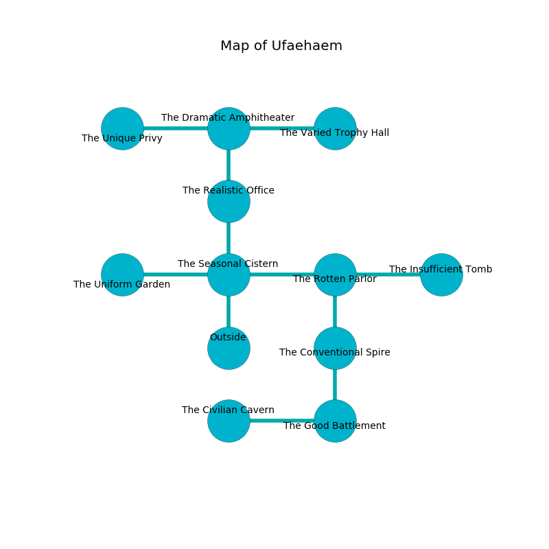

%Ruin Dogs

##Ufaehaem
###Overview
Ufaehaem is constructed on a volcanic rift. Some rooms of Ufaehaem are somewhat hot. The ruin is coming to life. It is occupied by Sprites. Vaughn Rudolph The Rude, a Fire Giant is here. The Sprites are ruled by Vaughn Rudolph The Rude. He  is trying to destroy [The Lonely Envelope](#The-Lonely-Envelope). 

###Artifact
####The Lonely Envelope

The Lonely Envelope is a powerful artifact in the shape of an opaque spear. Power pours near it. It smells like bouillon. When cradled it becomes lost. 

###Locations

####the seasonal cistern
The floor is smooth. Green lichens are swaying in broken urns. The concrete walls are covered in mold. The air tastes like eggs here. 

* There is a hook here.
* To the west a twisted walkway connects to [the uniform garden](#the-uniform-garden).
* To the east a twisted threshold connects to [the rotten parlor](#the-rotten-parlor).
* To the north a long artery opens to [the realistic office](#the-realistic-office).
* To the south is the entrance.

####the rotten parlor
The air smells like solvent here. 

* To the west a twisted threshold opens to [the seasonal cistern](#the-seasonal-cistern).
* To the east a hazy threshold opens to [the insufficient tomb](#the-insufficient-tomb).
* To the south a flooded corridor leads to [the conventional spire](#the-conventional-spire).

####the conventional spire
The floor is smooth. The air tastes like fougere here. There are an Invisible Stalker, a Githyanki Knight, and a Polar Bear here. 

* To the north a flooded corridor leads to [the rotten parlor](#the-rotten-parlor).
* To the south a dark passageway leads to [the good battlement](#the-good-battlement).

####the realistic office
The air smells like chestnut here. There are forty Sprites here. The brick walls are bloodstained. One of the Sprites is pointing a ballista at the entrance. 

There is an engraving on the wall written in Sprites Script. 

> We are hidden
>
> spatial, paralyzed, profound
>
> invisible and indirect
>

* There is a stick here.
* [Vaughn Rudolph The Rude](#Vaughn-Rudolph-The-Rude) is here.
* To the north a twisted cavern opens to [the dramatic amphitheater](#the-dramatic-amphitheater).
* To the south a long artery opens to [the seasonal cistern](#the-seasonal-cistern).

####the uniform garden
The crystal walls are pristine. 

* To the east a twisted walkway connects to [the seasonal cistern](#the-seasonal-cistern).

####the good battlement
The floor is smooth. There are a Wraith and a Young Copper Dragon here. 

There is an engraving on a stone written in Sprites Script. 

> [The Lonely Envelope](#The-Lonely-Envelope)
>
> yet religious
>
> you are not destroyed
>

* To the west a narrow hall connects to [the civilian cavern](#the-civilian-cavern).
* To the north a dark passageway connects to [the conventional spire](#the-conventional-spire).

####the civilian cavern
There are forty Sprites here. The metallic walls are unsettled. Red razorgrass is growing in a patch on the floor. One of the Sprites is on watch, the rest are drunk. 

There is an engraving on the wall written in common. 

> A ticket is a vision
>
> weekly, visual, necessary
>
> A ticket is a vision
>

* To the east a narrow hall connects to [the good battlement](#the-good-battlement).

####the dramatic amphitheater
There is a trap here. When activated, a magical sound detector will launch stone blocks from the ceiling. The air smells like egg nog here. The floor is sticky. There are forty Sprites here. The Sprites are crazy with bloodlust. 

* There is a bee here.
* [The Lonely Envelope](#The-Lonely-Envelope) is here.
* To the west a twisted gap leads to [the unique privy](#the-unique-privy).
* To the east a long walkway connects to [the varied trophy hall](#the-varied-trophy-hall).
* To the south a twisted cavern opens to [the realistic office](#the-realistic-office).

####the varied trophy hall
The glass walls are bloodstained. The air tastes like violet leaf here. The floor is flooded with one inch deep cool water. 

There is an engraving on the floor written in Sprites Script. 

> A hospital is a grimace
>
> helpful and continental
>
> regional and financial
>
> yet legal
>

* To the west a long walkway connects to [the dramatic amphitheater](#the-dramatic-amphitheater).

####the insufficient tomb
The wooden walls are unsettled. Gray ferns are swaying from the walls. 

* To the west a hazy threshold connects to [the rotten parlor](#the-rotten-parlor).

####the unique privy
The floor is glossy. Blue mushrooms are swaying from the ceiling. 

* To the east a twisted gap opens to [the dramatic amphitheater](#the-dramatic-amphitheater).

