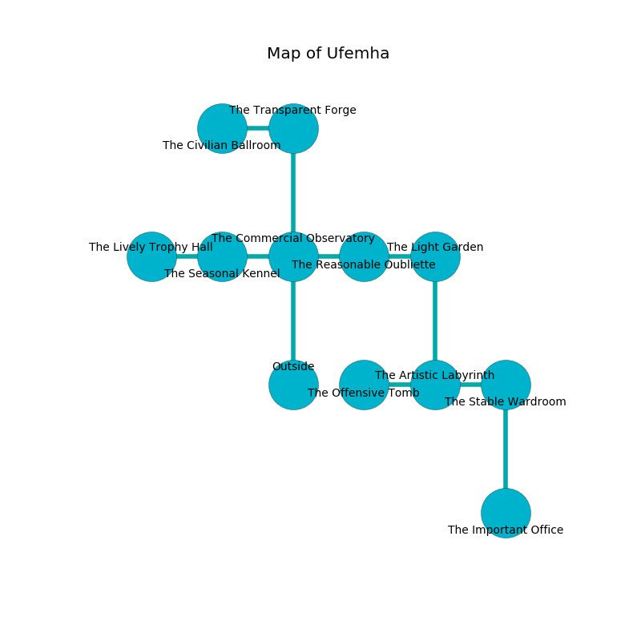

%Ruin Dogs

##Ufemha
###Overview
Ufemha is located in a broken city. Some rooms of Ufemha are corrupted. The ruin is larger on the inside than the outside. It is occupied by Satyrs. Geraldo Royer The Bone-Idle, a Mind Flayer Arcanist is here. The Satyrs are the soldiers of Geraldo Royer The Bone-Idle. He  is founding a new religion. 

###Artifact
####Ges Dememe

Ges Dememe has the form of a warm rock. It smells like molasses. When carried it levitates surrounding objects. 

###Locations

####the commercial observatory
Blue razorgrass is growing from the walls. There are a Doppelganger, an Ape, a Fire Elemental, and a Kuo-Toa Monitor here. 

* To the west a windy threshold connects to [the seasonal kennel](#the-seasonal-kennel).
* To the east a dark walkway opens to [the reasonable oubliette](#the-reasonable-oubliette).
* To the north a twisted threshold leads to [the transparent forge](#the-transparent-forge).
* To the south is the entrance.

####the seasonal kennel
The floor is sticky. 

* There is a parcel here.
* To the west a windy hall opens to [the lively trophy hall](#the-lively-trophy-hall).
* To the east a windy threshold connects to [the commercial observatory](#the-commercial-observatory).

####the transparent forge
Gray ferns are growing in cracks in the floor. The air smells like cucumber skin here. The stone walls are ruined. 

* To the west a long opening opens to [the civilian ballroom](#the-civilian-ballroom).
* To the south a twisted threshold connects to [the commercial observatory](#the-commercial-observatory).

####the reasonable oubliette
The floor is bloodstained. There are two Shambling Mounds here. 

* [Geraldo Royer The Bone-Idle](#Geraldo-Royer-The-Bone-Idle) is here.
* To the west a dark walkway leads to [the commercial observatory](#the-commercial-observatory).
* To the east a hazy artery opens to [the light garden](#the-light-garden).

####the lively trophy hall
There are sixteen Satyrs here. The air smells like lavender here. The Satyrs are willing to negotiate. 

There is an engraving on the floor written in common. 

> I am lost in Ufemha.
>
> Leave at once.
>

* To the east a windy hall connects to [the seasonal kennel](#the-seasonal-kennel).

####the light garden
The concrete walls are pristine. There are a Manticore, a Fomorian, and a Worg here. 

There is an engraving on a tablet written in common. 

> Oh pitiful you
>
> always clean
>
> visual, first, new
>
> everything is marine
>

* To the west a hazy artery leads to [the reasonable oubliette](#the-reasonable-oubliette).
* To the south a flooded gap opens to [the artistic labyrinth](#the-artistic-labyrinth).

####the civilian ballroom
The floor is glossy. The wooden walls are pristine. 

* To the east a long opening opens to [the transparent forge](#the-transparent-forge).

####the artistic labyrinth
The floor is flooded with two inch deep cool water. The air smells like gardenia here. Yellow ferns are swaying in broken urns. 

* To the west a windy hallway leads to [the offensive tomb](#the-offensive-tomb).
* To the east a long cave leads to [the stable wardroom](#the-stable-wardroom).
* To the north a flooded gap leads to [the light garden](#the-light-garden).

####the offensive tomb
There are a Minotaur and a Drow Priestess of Lolth here. The obsidion walls are ruined. 

* There is a shoe here.
* There is a scissors here.
* To the east a windy hallway opens to [the artistic labyrinth](#the-artistic-labyrinth).

####the stable wardroom
The mirrored walls are pristine. 

* [Ges Dememe](#Ges-Dememe) is here.
* To the west a long cave connects to [the artistic labyrinth](#the-artistic-labyrinth).
* To the south a windy corridor opens to [the important office](#the-important-office).

####the important office
The air smells like graham cracker here. There are a Young Black Dragon, a Ghoul, and a Gladiator here. Blue moss is swaying in a patch on the floor. 

* To the north a windy corridor leads to [the stable wardroom](#the-stable-wardroom).

