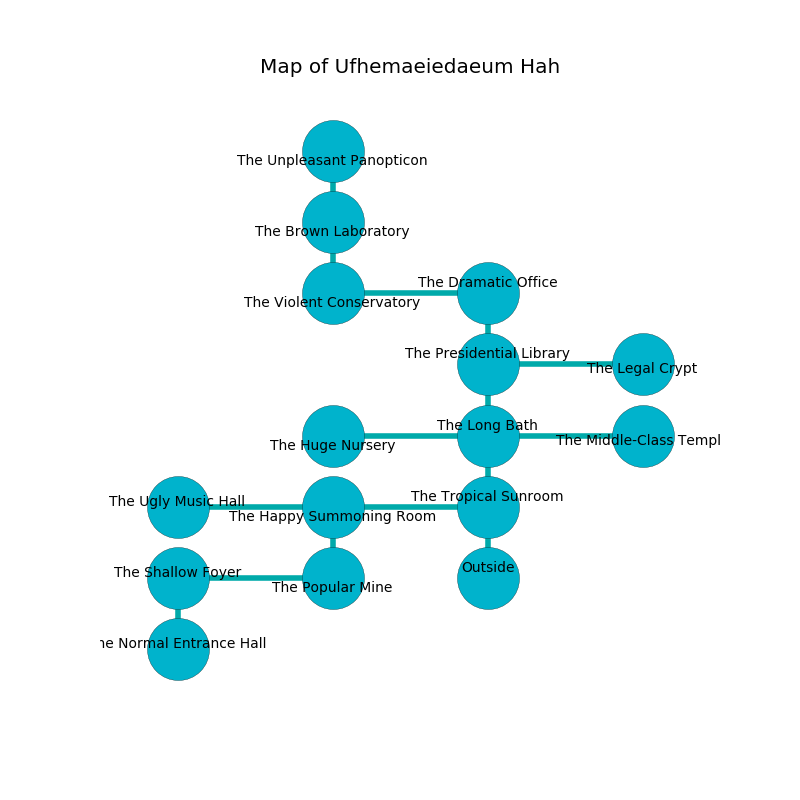

%Ruin Dogs

##Ufhemaeiedaeum Hah
###Overview
Ufhemaeiedaeum Hah is located under a haunted mountain. Regions of it are corrupted. The ruin is flooding. It is occupied by Troglodytes. Ann Velasco The Belligerent, a Fire Giant is here. The Troglodytes are the soldiers of Ann Velasco The Belligerent. She  is trying to steal [Hfeloeda](#Hfeloeda). 

###Artifact
####Hfeloeda

Hfeloeda has the form of a cold blade. It is a light blue color. When gazed upon it aids memory. 

###Locations

####the tropical sunroom
The floor is sticky. 

* There is a hammer here.
* To the west a windy artery connects to [the happy summoning room](#the-happy-summoning-room).
* To the north a hazy cave leads to [the long bath](#the-long-bath).
* To the south is the entrance.

####the long bath
There are forty Troglodytes here. There is a trap here. When activated, a magical proximity detector will collapse a wall. Gray lichens are decaying from the ceiling. The Troglodytes are performing a ritual. If not interrupted, the Troglodytes will become more powerful. 

* To the west a torchlit gap leads to [the huge nursery](#the-huge-nursery).
* To the east a dark walkway connects to [the middle-class temple](#the-middle-class-temple).
* To the north a windy path leads to [the presidential library](#the-presidential-library).
* To the south a hazy cave opens to [the tropical sunroom](#the-tropical-sunroom).

####the happy summoning room
There are forty Troglodytes here. The floor is flooded with seven inch deep lukewarm water. The air smells like celery here. The wooden walls are scratched. Blue ferns are growing in broken urns. The Troglodytes are berserk with rage. 

There is an engraving on the ceiling written in common. 

> O my life is inhumane
>
> qualified, flexible, main
>
> premature and restless
>
> fate is main
>

* To the west a windy path opens to [the ugly music hall](#the-ugly-music-hall).
* To the east a windy artery leads to [the tropical sunroom](#the-tropical-sunroom).
* To the south a dark cavern leads to [the popular mine](#the-popular-mine).

####the presidential library
The metallic walls are scratched. 

* There is a kettle here.
* To the east a dripping artery connects to [the legal crypt](#the-legal-crypt).
* To the north a dripping cavern connects to [the dramatic office](#the-dramatic-office).
* To the south a windy path opens to [the long bath](#the-long-bath).

####the dramatic office
Blue ferns are sprouting from the walls. There are forty Troglodytes here. One of the Troglodytes is working a mechanism that can open a trapodoor in the floor. 

* [Ann Velasco The Belligerent](#Ann-Velasco-The-Belligerent) is here.
* To the west a torchlit hall opens to [the violent conservatory](#the-violent-conservatory).
* To the south a dripping cavern leads to [the presidential library](#the-presidential-library).

####the popular mine
Blue lichens are growing in broken urns. The floor is sticky. 

* To the west a twisted corridor leads to [the shallow foyer](#the-shallow-foyer).
* To the north a dark cavern connects to [the happy summoning room](#the-happy-summoning-room).

####the violent conservatory
The floor is sticky. The glass walls are ruined. 

* To the east a torchlit hall connects to [the dramatic office](#the-dramatic-office).
* To the north a torchlit cave leads to [the brown laboratory](#the-brown-laboratory).

####the shallow foyer
There is a Guardian Naga here. Blue moss is swaying from the walls. 

* To the east a twisted corridor connects to [the popular mine](#the-popular-mine).
* To the south a long artery opens to [the normal entrance hall](#the-normal-entrance-hall).

####the brown laboratory
The air tastes like rhubarb here. 

* [Hfeloeda](#Hfeloeda) is here.
* To the north a long walkway connects to [the unpleasant panopticon](#the-unpleasant-panopticon).
* To the south a torchlit cave leads to [the violent conservatory](#the-violent-conservatory).

####the middle-class temple
The air tastes like raspberry here. The crystal walls are bloodstained. 

There is an engraving on a tablet written in Troglodytes Script. 

> I am lost in Ufhemaeiedaeum Hah.
>

* To the west a dark walkway opens to [the long bath](#the-long-bath).

####the legal crypt
The air smells like cloth here. The floor is flooded with six inch deep scalding water. The metallic walls are caving in. There are forty Troglodytes here. The Troglodytes are performing a ritual. If not interrupted, the Troglodytes will become more powerful. 

* To the west a dripping artery opens to [the presidential library](#the-presidential-library).

####the huge nursery
The floor is smooth. There are a Wight, a Kuo-Toa Monitor, an Axe Beak, a Minotaur, a Bugbear, and a Giant Badger here. The air smells like muguet here. 

There is an engraving on the floor written in Troglodytes Script. 

> Go away.
>

* To the east a torchlit gap leads to [the long bath](#the-long-bath).

####the ugly music hall
There are forty Troglodytes here. Yellow razorgrass is decaying in a patch on the floor. One of the Troglodytes is pointing a ballista at the entrance. 

* To the east a windy path connects to [the happy summoning room](#the-happy-summoning-room).

####the normal entrance hall
The floor is bloodstained. The air tastes like melon rind here. There are forty Troglodytes here. The Troglodytes are performing a ritual. If not interrupted, [Ann Velasco](#Ann-Velasco) will be magically alarmed. 

There is an engraving on a stone written in common. 

> I am looting this place.
>
> Maybe try praying.
>

* To the north a long artery leads to [the shallow foyer](#the-shallow-foyer).

####the unpleasant panopticon
The air smells like fir needle here. White lichens are sprouting from the ceiling. There are forty Troglodytes here. The wooden walls are ruined. One of the Troglodytes is pointing a ballista at the entrance. 

* To the south a long walkway leads to [the brown laboratory](#the-brown-laboratory).

