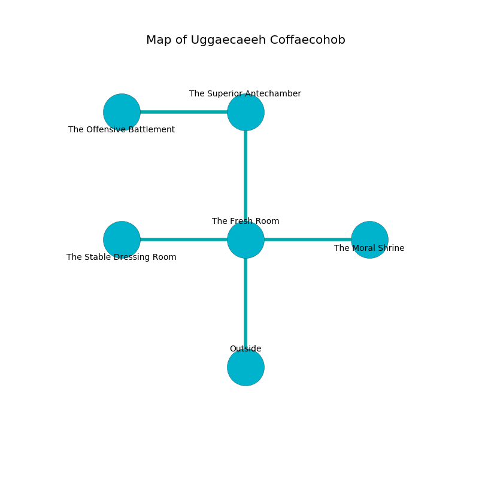

%Ruin Dogs

##Uggaecaeeh Coffaecohob
###Overview
Uggaecaeeh Coffaecohob is constructed on a giant city. Regions of Uggaecaeeh Coffaecohob are unbearably cold. A blizzard is happening outside. It is occupied by Kobolds. Fernando Mcclinton The Untidy, a Barbed Devil is here. The Kobolds worship Fernando Mcclinton The Untidy. He  is trying to discover [The Formal Relaxation](#The-Formal-Relaxation). 

###Artifact
####The Formal Relaxation

The Formal Relaxation is a powerful artifact in the shape of an opaque prism. It smells like davana. Gravity slides away from it. It is a dark black color. When worn it flies into the air. 

###Locations

####the fresh room
The floor is glossy. There are fourteen Winged Kobolds and twenty one Kobolds here. If the Kobolds notice the Ruin Dogs, one of them will retreat and alert [Fernando Mcclinton](#Fernando-Mcclinton). 

* [The Formal Relaxation](#The-Formal-Relaxation) is here.
* To the west a dripping artery leads to [the stable dressing room](#the-stable-dressing-room).
* To the east a narrow path connects to [the moral shrine](#the-moral-shrine).
* To the north a flooded path opens to [the superior antechamber](#the-superior-antechamber).
* To the south is the entrance.

####the stable dressing room
The floor is bloodstained. 

* There is a button here.
* To the east a dripping artery connects to [the fresh room](#the-fresh-room).

####the superior antechamber
The air smells like musk here. Gray lichens are sprouting from the walls. The floor is glossy. 

* [Fernando Mcclinton The Untidy](#Fernando-Mcclinton-The-Untidy) is here.
* To the west a dripping corridor opens to [the offensive battlement](#the-offensive-battlement).
* To the south a flooded path leads to [the fresh room](#the-fresh-room).

####the offensive battlement
There are fourteen Winged Kobolds and twenty one Kobolds here. The air tastes like horhound here. The Kobolds are performing a ritual. If not interrupted, [Fernando Mcclinton](#Fernando-Mcclinton) will be magically alarmed. 

* There is a head here.
* To the east a dripping corridor connects to [the superior antechamber](#the-superior-antechamber).

####the moral shrine
Red ferns are sprouting from the ceiling. The floor is flooded with five inch deep hot water. 

* To the west a narrow path leads to [the fresh room](#the-fresh-room).

