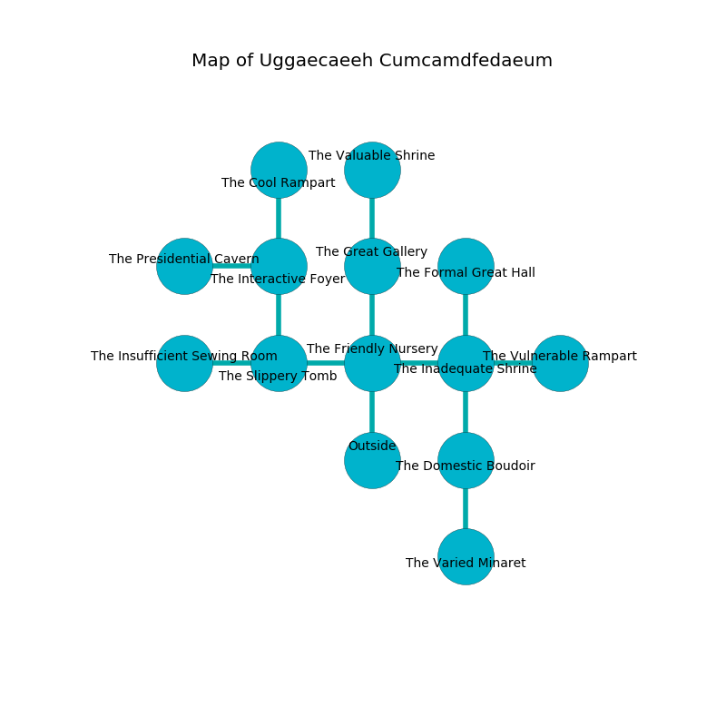

%Ruin Dogs

##Uggaecaeeh Cumcamdfedaeum
###Overview
Uggaecaeeh Cumcamdfedaeum is located in an alien city. Regions of it are flooded. A battle between raiders is happening outside. It is occupied by Humans. Florentina Dockery The Gullible, a Knight is here. The Humans are the soldiers of Florentina Dockery The Gullible. She  is trying to steal [The Qualified Occasion](#The-Qualified-Occasion). 

###Artifact
####The Qualified Occasion

The Qualified Occasion has the form of a glassy spear. When rubbed it becomes a force of destiny. 

###Locations

####the friendly nursery
There are a Thug, a Priest, a Druid, two Scouts, and  here. The obsidion walls are scratched. The air smells like oak wood here. One of the Humans is on watch, the rest are fighting amongst themselves. 

* There is a dragon here.
* There is a carriage here.
* There is a parcel here.
* There is a pig here.
* To the west a dark hall opens to [the slippery tomb](#the-slippery-tomb).
* To the east a dripping opening connects to [the inadequate shrine](#the-inadequate-shrine).
* To the north a small cavern opens to [the great gallery](#the-great-gallery).
* To the south is the entrance.

####the slippery tomb
The concrete walls are ruined. There are a Tribal Warrior, a Cultist, a Druid, and a Berserker here. The floor is sticky. Yellow moss is sprouting in broken urns. The Humans are performing a ritual. If not interrupted, the ruin dogs will be weakened. 

* There is a brick here.
* To the west a torchlit hall connects to [the insufficient sewing room](#the-insufficient-sewing-room).
* To the east a dark hall leads to [the friendly nursery](#the-friendly-nursery).
* To the north a windy pathway connects to [the interactive foyer](#the-interactive-foyer).

####the great gallery
Red mushrooms are decaying from the ceiling. The metallic walls are scratched. There is a trap here. When activated, a tripwire will fire an acid arrow. The floor is flooded with seven inch deep cold water. 

There is an engraving on a stone written in common. 

> I thought about praying.
>

* To the north a torchlit cave leads to [the valuable shrine](#the-valuable-shrine).
* To the south a small cavern opens to [the friendly nursery](#the-friendly-nursery).

####the interactive foyer
There are a Deep Gnome, a Flumph, a Gold Dragon Wyrmling, a Grell, and a Needle Blight here. The obsidion walls are bloodstained. There is a trap here. When activated, a magical proximity detector will cast a curse. Blue mushrooms are sprouting from the walls. 

There is an engraving on a monolith written in common. 

> O terrible god
>
> but long
>
> but odd
>
> fate is wrong
>

* [The Qualified Occasion](#The-Qualified-Occasion) is here.
* To the west a torchlit path connects to [the presidential cavern](#the-presidential-cavern).
* To the north a dark artery leads to [the cool rampart](#the-cool-rampart).
* To the south a windy pathway leads to [the slippery tomb](#the-slippery-tomb).

####the inadequate shrine
The mirrored walls are scratched. The air smells like bay here. 

* There is a knot here.
* To the west a dripping opening connects to [the friendly nursery](#the-friendly-nursery).
* To the east a small gap connects to [the vulnerable rampart](#the-vulnerable-rampart).
* To the north a twisted cavern connects to [the formal great hall](#the-formal-great-hall).
* To the south a long hallway leads to [the domestic boudoir](#the-domestic-boudoir).

####the domestic boudoir
There are a Blink Dog, a Gas Spore, a Hobgoblin, a Berserker, a Giant Wasp, a Flying Sword, and a Constrictor Snake here. 

* There is a pig here.
* To the north a long hallway leads to [the inadequate shrine](#the-inadequate-shrine).
* To the south a flooded hall connects to [the varied minaret](#the-varied-minaret).

####the insufficient sewing room
The floor is bloodstained. The air smells like barley here. 

* To the east a torchlit hall connects to [the slippery tomb](#the-slippery-tomb).

####the vulnerable rampart
The floor is cluttered with broken glass. The mirrored walls are covered in mold. The air smells like petroleum here. 

* To the west a small gap opens to [the inadequate shrine](#the-inadequate-shrine).

####the formal great hall
The air smells like horhound here. There are a Lamia and a Hyena here. 

* To the south a twisted cavern leads to [the inadequate shrine](#the-inadequate-shrine).

####the presidential cavern
The air tastes like sulfur here. There are a Hobgoblin, a Sahuagin Priestess, a Gnoll Pack Lord, a Giant Badger, and a Half-Ogre here. The stone walls are covered in mold. 

* To the east a torchlit path opens to [the interactive foyer](#the-interactive-foyer).

####the varied minaret
The crystal walls are covered in mold. There are a Grell, a Monodrone, a Boar, a Gnoll, a Brass Dragon Wyrmling, and a Scorpion here. 

* To the north a flooded hall opens to [the domestic boudoir](#the-domestic-boudoir).

####the valuable shrine
The air tastes like coconut here. The mirrored walls are bloodstained. 

* [Florentina Dockery The Gullible](#Florentina-Dockery-The-Gullible) is here.
* To the south a torchlit cave connects to [the great gallery](#the-great-gallery).

####the cool rampart
The floor is smooth. 

* To the south a dark artery opens to [the interactive foyer](#the-interactive-foyer).

