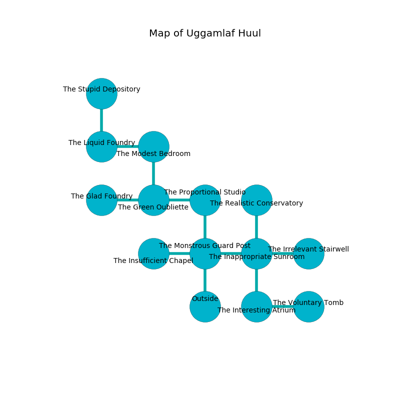

%Ruin Dogs

##Uggamlaf Huul
###Overview
Uggamlaf Huul is located under a crystal plain. Some areas of Uggamlaf Huul are foggy. A solar eclipse is happening outside. It is occupied by Sprites. Lessie English The Secretive, a Gladiator is here. The Sprites are the minions of Lessie English The Secretive. She  is trying to discover [The Outer Note](#The-Outer-Note). 

###Artifact
####The Outer Note

The Outer Note looks like a transparent sphere. When held it ignites its surrroundings. 

###Locations

####the monstrous guard post
The floor is smooth. The air smells like hyacinth here. The wooden walls are covered in mold. 

* To the west a flooded corridor leads to [the insufficient chapel](#the-insufficient-chapel).
* To the east a narrow hallway opens to [the inappropriate sunroom](#the-inappropriate-sunroom).
* To the north a small hallway connects to [the proportional studio](#the-proportional-studio).
* To the south is the entrance.

####the inappropriate sunroom
Gray moss is sprouting in a patch on the floor. 

* To the west a narrow hallway connects to [the monstrous guard post](#the-monstrous-guard-post).
* To the east a dark cave connects to [the irrelevant stairwell](#the-irrelevant-stairwell).
* To the north a twisted cave opens to [the realistic conservatory](#the-realistic-conservatory).
* To the south a dripping walkway connects to [the interesting atrium](#the-interesting-atrium).

####the insufficient chapel
There are sixteen Sprites here. The obsidion walls are caving in. The floor is smooth. The Sprites are caring for babies. 

* There is a face here.
* There is a dragon here.
* To the east a flooded corridor leads to [the monstrous guard post](#the-monstrous-guard-post).

####the proportional studio
Green mushrooms are sprouting in a patch on the floor. The air tastes like lychee here. The floor is sticky. 

* To the west a twisted cavern connects to [the green oubliette](#the-green-oubliette).
* To the south a small hallway connects to [the monstrous guard post](#the-monstrous-guard-post).

####the interesting atrium
The stone walls are bloodstained. Blue lichens are swaying in broken urns. 

There is an engraving on a tablet written in common. 

> I am defending this place.
>
> I tried hiding.
>

* To the east a twisted opening opens to [the voluntary tomb](#the-voluntary-tomb).
* To the north a dripping walkway leads to [the inappropriate sunroom](#the-inappropriate-sunroom).

####the green oubliette
Gray ferns are swaying in a patch on the floor. The obsidion walls are bloodstained. There are sixteen Sprites here. The Sprites are willing to fight to the death. 

* There is a dragon here.
* To the west a small corridor opens to [the glad foundry](#the-glad-foundry).
* To the east a twisted cavern opens to [the proportional studio](#the-proportional-studio).
* To the north a windy walkway opens to [the modest bedroom](#the-modest-bedroom).

####the irrelevant stairwell
The metallic walls are covered in mold. There are a Rug of Smothering and a Hell Hound here. The air tastes like black currant here. White ferns are decaying from the walls. 

* To the west a dark cave leads to [the inappropriate sunroom](#the-inappropriate-sunroom).

####the realistic conservatory
The air smells like beef here. The glass walls are ruined. The floor is cluttered with rocks. Red lichens are sprouting in a patch on the floor. 

There is an engraving on the floor written in common. 

> [The Outer Note](#The-Outer-Note)
>
> social, unpleasant, feminine
>
> closed and minimum
>
> ever tight
>
> always smart
>
> A circle is a colony
>
> expensive, illegal, stunning
>
> yet internal
>
> applied and stubborn
>
> you are captured
>

* There is a glove here.
* To the south a twisted cave connects to [the inappropriate sunroom](#the-inappropriate-sunroom).

####the voluntary tomb
The floor is sticky. Green ferns are growing in a patch on the floor. The obsidion walls are unsettled. The air tastes like foliage here. 

* To the west a twisted opening connects to [the interesting atrium](#the-interesting-atrium).

####the glad foundry
The air tastes like vetiver here. Blue moss is sprouting in cracks in the floor. 

* [Lessie English The Secretive](#Lessie-English-The-Secretive) is here.
* To the east a small corridor leads to [the green oubliette](#the-green-oubliette).

####the modest bedroom
The air tastes like salt here. The mirrored walls are ruined. There are sixteen Sprites here. One of the Sprites is on watch, the rest are celebrating. 

* To the west a narrow pathway leads to [the liquid foundry](#the-liquid-foundry).
* To the south a windy walkway connects to [the green oubliette](#the-green-oubliette).

####the liquid foundry
There are sixteen Sprites here. The Sprites are willing to negotiate. 

There is an engraving on a tablet written in Sprites Script. 

> O! the memory of you is sadistic
>
> it is never late
>
> technical and artistic
>
> everything is great
>

* [The Outer Note](#The-Outer-Note) is here.
* To the east a narrow pathway connects to [the modest bedroom](#the-modest-bedroom).
* To the north a dripping artery leads to [the stupid depository](#the-stupid-depository).

####the stupid depository
Gray razorgrass is growing in a patch on the floor. The floor is flooded with four inch deep cold water. The metallic walls are pristine. 

* There is a spear here.
* To the south a dripping artery leads to [the liquid foundry](#the-liquid-foundry).

