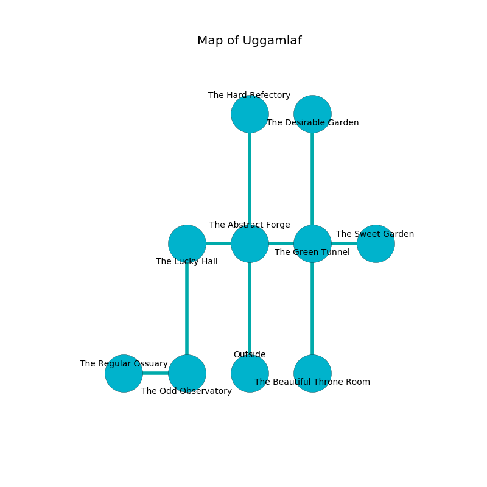

%Ruin Dogs

##Uggamlaf
###Overview
Uggamlaf is constructed on a poisoned mountain. Some rooms of Uggamlaf are inaccessible. A massive storm is happening outside. It is occupied by Humans. Barry Kennedy The Impatient, a Yuan-Ti Malison is here. The Humans are the slaves of Barry Kennedy The Impatient. He  is trying to research [Idwiha](#Idwiha). 

###Artifact
####Idwiha

Idwiha has the form of a wet monument. It smells like coffee. It is a dark green color. When rubbed it destroys others. 

###Locations

####the abstract forge
There are a Thug, a Cult Fanatic, and a Druid here. The air smells like honeysuckle here. The brick walls are caving in. One of the Humans is pointing a ballista at the entrance. 

* [Idwiha](#Idwiha) is here.
* [Barry Kennedy The Impatient](#Barry-Kennedy-The-Impatient) is here.
* To the west a twisted walkway leads to [the lucky hall](#the-lucky-hall).
* To the east a torchlit corridor opens to [the green tunnel](#the-green-tunnel).
* To the north a small cavern opens to [the hard refectory](#the-hard-refectory).
* To the south is the entrance.

####the green tunnel
The floor is smooth. The air tastes like apple here. The obsidion walls are covered in mold. Green lichens are growing in cracks in the floor. 

There is an engraving on a tablet written in Humans Script. 

> Dear me! meak fate
>
> crude and archaeological
>
> small and great
>
> sadness is geological
>

* There is a goat here.
* To the west a torchlit corridor connects to [the abstract forge](#the-abstract-forge).
* To the east a flooded gap opens to [the sweet garden](#the-sweet-garden).
* To the north a dripping cavern leads to [the desirable garden](#the-desirable-garden).
* To the south a narrow walkway connects to [the beautiful throne room](#the-beautiful-throne-room).

####the lucky hall

* There is a rail here.
* To the east a twisted walkway connects to [the abstract forge](#the-abstract-forge).
* To the south a hazy path leads to [the odd observatory](#the-odd-observatory).

####the odd observatory
The air tastes like camphoreous here. The metallic walls are unsettled. 

* To the west a twisted cavern leads to [the regular ossuary](#the-regular-ossuary).
* To the north a hazy path opens to [the lucky hall](#the-lucky-hall).

####the sweet garden
There are a Cult Fanatic, a Veteran, three Tribal Warriors,  here. One of the Humans is pointing a ballista at the entrance. 

* There is a goat here.
* To the west a flooded gap leads to [the green tunnel](#the-green-tunnel).

####the beautiful throne room
There are an Old Faerie Dragon, a Dretch, a Giant Sea Horse, a Quadrone, and a Giant Elk here. 

* To the north a narrow walkway leads to [the green tunnel](#the-green-tunnel).

####the desirable garden
The floor is cluttered with broken glass. Yellow moss is decaying in cracks in the floor. 

There is an engraving on the floor written in common. 

> You are frozen
>
> blank, fair, large
>
> You are hidden
>
> accessible, clean, useful
>
> open, balanced, wise
>
> yet resident
>
> A drain is a drama
>
> human and cute
>
> imperial, unpleasant, desirable
>
> ever obvious
>
> academic, technical, solar
>
> We are free
>
> yet never modest
>
> A map is a cell
>
> ever deep
>
> surprised and square
>
> plain, tasty, cruel
>
> [Idwiha](#Idwiha)
>
> always glorious
>
> always junior
>
> premature and archaeological
>
> operational and inevitable
>
> operational, harsh, flawed
>
> sophisticated and good
>
> You are frozen
>

* To the south a dripping cavern leads to [the green tunnel](#the-green-tunnel).

####the regular ossuary
There are a Cult Fanatic, a Thug, a Tribal Warrior, a Priest, and an Acolyte here. The air tastes like marshmallow here. The floor is cluttered with broken glass. Blue razorgrass is decaying in a patch on the floor. If the Humans notice the Ruin Dogs, one of them will retreat and alert [Barry Kennedy](#Barry-Kennedy). 

* To the east a twisted cavern opens to [the odd observatory](#the-odd-observatory).

####the hard refectory
The air tastes like seafood here. The wooden walls are pristine. The floor is glossy. 

* To the south a small cavern opens to [the abstract forge](#the-abstract-forge).

