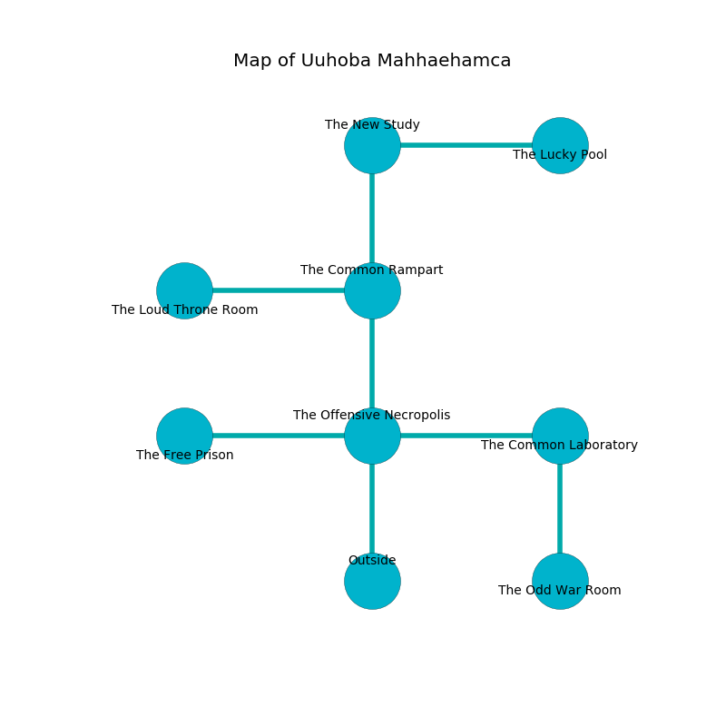

%Ruin Dogs

##Uuhoba Mahhaehamca
###Overview
Uuhoba Mahhaehamca is located on a spikey tree. Parts of Uuhoba Mahhaehamca are corrupted. A windstorm is happening outside. It is occupied by Kuo-Toa. Chi Tijerina The Perverse, a Drow Priestess of Lolth is here. The Kuo-Toa have been charmed by Chi Tijerina The Perverse. He  is trying to steal [The Clear Immigration](#The-Clear-Immigration). 

###Artifact
####The Clear Immigration

The Clear Immigration has the form of a sharp prism. It is a bright gray color. When picked up it ignites its surrroundings. 

###Locations

####the offensive necropolis
Green razorgrass is swaying in cracks in the floor. The glass walls are scratched. The air tastes like cocoa here. 

* There is a drawer here.
* [The Clear Immigration](#The-Clear-Immigration) is here.
* To the west a dark artery opens to [the free prison](#the-free-prison).
* To the east a torchlit threshold connects to [the common laboratory](#the-common-laboratory).
* To the north a twisted corridor opens to [the common rampart](#the-common-rampart).
* To the south is the entrance.

####the common laboratory
Blue mushrooms are growing in broken urns. There are three Kuo-Toa Whips, two Kuo-Toa Monitors, two Kuo-Toa,  here. The Kuo-Toa are defending this room from intruders. 

There is an engraving on the wall written in common. 

> Go away.
>

* [Chi Tijerina The Perverse](#Chi-Tijerina-The-Perverse) is here.
* To the west a torchlit threshold leads to [the offensive necropolis](#the-offensive-necropolis).
* To the south a dripping hallway connects to [the odd war Room](#the-odd-war-Room).

####the common rampart
The floor is smooth. The air smells like mango here. There are a Kuo-Toa Whip, a Kuo-Toa Archpriest, two Kuo-Toa, and  here. The Kuo-Toa are willing to negotiate. 

* To the west a small cave connects to [the loud throne room](#the-loud-throne-room).
* To the north a flooded walkway connects to [the new study](#the-new-study).
* To the south a twisted corridor opens to [the offensive necropolis](#the-offensive-necropolis).

####the new study
There are an Otyugh, a Quasit, a Warhorse Skeleton, a Merfolk, and a Quadrone here. The floor is smooth. 

There is an engraving on a monolith written in common. 

> I am lost in Uuhoba Mahhaehamca.
>
> I could not try fighting.
>

* To the east a dripping walkway opens to [the lucky pool](#the-lucky-pool).
* To the south a flooded walkway opens to [the common rampart](#the-common-rampart).

####the lucky pool
The air smells like leather here. The floor is sticky. 

There is an engraving on a tablet written in common. 

> I am worshipping this place.
>
> I tried hiding.
>

* There is a wand here.
* There is a door here.
* To the west a dripping walkway leads to [the new study](#the-new-study).

####the loud throne room
The wooden walls are scratched. The air tastes like zedoary here. 

* To the east a small cave connects to [the common rampart](#the-common-rampart).

####the odd war Room
The air tastes like seashore here. The floor is cluttered with rocks. There are two Kuo-Toa Archpriests here. One of the Kuo-Toa is working a mechanism that can pour snakes from the ceiling. 

* To the north a dripping hallway leads to [the common laboratory](#the-common-laboratory).

####the free prison
There are a Kuo-Toa Whip, a Kuo-Toa Monitor, a Kuo-Toa Archpriest, and a Kuo-Toa here. The glass walls are bloodstained. The floor is glossy. Red mushrooms are growing in a patch on the floor. The Kuo-Toa are willing to negotiate. 

* There is a glove here.
* To the east a dark artery leads to [the offensive necropolis](#the-offensive-necropolis).

